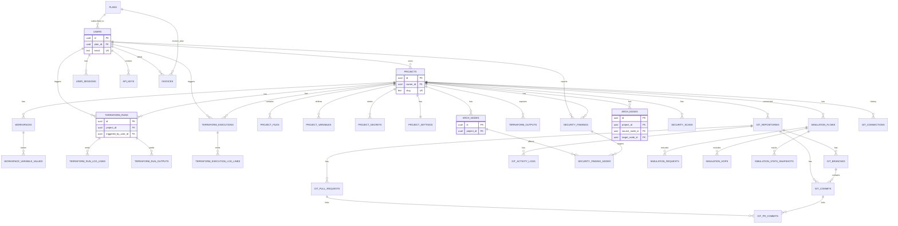

# DATABASE_SCHEMA

## Scope
Schema target: PostgreSQL 16 (Docker), SQLAlchemy 2.x async, Alembic migrations.

Design principles:
- UUID primary key on all tables (`uuid` + `gen_random_uuid()`)
- `created_at` and `updated_at` on all tables
- Explicit PostgreSQL ENUM types for frontend union/enums
- JSONB for flexible frontend-heavy structures (canvas node properties, logs payloads, metadata)
- Strong FK + cascade rules aligned with project ownership lifecycle

---

## 1) Entity Relationship Diagram (Mermaid)

---

## 2) Table Specifications

Type conventions:
- `id`: `uuid primary key default gen_random_uuid()`
- `created_at`: `timestamptz not null default now()`
- `updated_at`: `timestamptz not null default now()`
- `metadata` fields: `jsonb not null default '{}'::jsonb`

## 2.1 Identity, Auth, Billing

### `plans`
- `id uuid PK`
- `code plan_code_enum NOT NULL UNIQUE` (`free|pro|team|enterprise`)
- `name text NOT NULL`
- `monthly_price_cents integer NOT NULL DEFAULT 0 CHECK (monthly_price_cents >= 0)`
- `yearly_price_cents integer NOT NULL DEFAULT 0 CHECK (yearly_price_cents >= 0)`
- `limits jsonb NOT NULL` (projects, nodesPerProject, services, deploys, collaborators)
- `features text[] NOT NULL DEFAULT '{}'`
- `is_active boolean NOT NULL DEFAULT true`
- `created_at timestamptz NOT NULL DEFAULT now()`
- `updated_at timestamptz NOT NULL DEFAULT now()`

### `users`
- `id uuid PK`
- `plan_id uuid NOT NULL FK -> plans(id) ON DELETE RESTRICT`
- `email citext NOT NULL UNIQUE`
- `username citext NULL UNIQUE`
- `full_name text NOT NULL`
- `avatar_url text NULL`
- `hashed_password text NOT NULL`
- `is_active boolean NOT NULL DEFAULT true`
- `is_superuser boolean NOT NULL DEFAULT false`
- `last_login_at timestamptz NULL`
- `created_at timestamptz NOT NULL DEFAULT now()`
- `updated_at timestamptz NOT NULL DEFAULT now()`

### `user_sessions`
- `id uuid PK`
- `user_id uuid NOT NULL FK -> users(id) ON DELETE CASCADE`
- `refresh_token_hash text NOT NULL`
- `user_agent text NULL`
- `ip_address inet NULL`
- `expires_at timestamptz NOT NULL`
- `revoked_at timestamptz NULL`
- `created_at timestamptz NOT NULL DEFAULT now()`
- `updated_at timestamptz NOT NULL DEFAULT now()`
- Constraints:
  - `CHECK (expires_at > created_at)`

### `api_keys`
- `id uuid PK`
- `user_id uuid NOT NULL FK -> users(id) ON DELETE CASCADE`
- `name text NOT NULL`
- `key_prefix text NOT NULL`
- `key_hash text NOT NULL UNIQUE`
- `last_used_at timestamptz NULL`
- `expires_at timestamptz NULL`
- `revoked_at timestamptz NULL`
- `created_at timestamptz NOT NULL DEFAULT now()`
- `updated_at timestamptz NOT NULL DEFAULT now()`

### `invoices`
- `id uuid PK`
- `user_id uuid NOT NULL FK -> users(id) ON DELETE CASCADE`
- `plan_id uuid NOT NULL FK -> plans(id) ON DELETE RESTRICT`
- `external_invoice_id text NULL UNIQUE`
- `amount_cents integer NOT NULL CHECK (amount_cents >= 0)`
- `status invoice_status_enum NOT NULL`
- `issued_at timestamptz NOT NULL`
- `due_at timestamptz NOT NULL`
- `paid_at timestamptz NULL`
- `items_url text NULL`
- `metadata jsonb NOT NULL DEFAULT '{}'::jsonb`
- `created_at timestamptz NOT NULL DEFAULT now()`
- `updated_at timestamptz NOT NULL DEFAULT now()`
- Constraints:
  - `CHECK (due_at >= issued_at)`

## 2.2 Projects and Terraform Domain

### `projects`
- `id uuid PK`
- `owner_id uuid NOT NULL FK -> users(id) ON DELETE CASCADE`
- `name text NOT NULL`
- `slug text NOT NULL UNIQUE`
- `description text NOT NULL DEFAULT ''`
- `cloud_provider cloud_provider_enum NOT NULL DEFAULT 'aws'`
- `region text NOT NULL`
- `environment text NULL`
- `status project_status_enum NOT NULL DEFAULT 'draft'`
- `node_count integer NOT NULL DEFAULT 0 CHECK (node_count >= 0)`
- `estimated_cost numeric(12,2) NOT NULL DEFAULT 0 CHECK (estimated_cost >= 0)`
- `last_deployed_at timestamptz NULL`
- `archived_at timestamptz NULL`
- `metadata jsonb NOT NULL DEFAULT '{}'::jsonb`
- `created_at timestamptz NOT NULL DEFAULT now()`
- `updated_at timestamptz NOT NULL DEFAULT now()`

### `project_files`
- `id uuid PK`
- `project_id uuid NOT NULL FK -> projects(id) ON DELETE CASCADE`
- `path text NOT NULL`
- `name text NOT NULL`
- `file_type file_type_enum NOT NULL` (`file|folder`)
- `language text NULL`
- `content text NULL`
- `size_bytes bigint NOT NULL DEFAULT 0 CHECK (size_bytes >= 0)`
- `checksum_sha256 text NULL`
- `is_deleted boolean NOT NULL DEFAULT false`
- `created_by_user_id uuid NULL FK -> users(id) ON DELETE SET NULL`
- `updated_by_user_id uuid NULL FK -> users(id) ON DELETE SET NULL`
- `created_at timestamptz NOT NULL DEFAULT now()`
- `updated_at timestamptz NOT NULL DEFAULT now()`
- Constraints:
  - `UNIQUE (project_id, path)`

### `project_variables`
- `id uuid PK`
- `project_id uuid NOT NULL FK -> projects(id) ON DELETE CASCADE`
- `key text NOT NULL`
- `value text NOT NULL DEFAULT ''`
- `description text NULL`
- `value_type terraform_variable_type_enum NOT NULL`
- `is_terraform_var boolean NOT NULL DEFAULT true`
- `is_secret boolean NOT NULL DEFAULT false`
- `default_value text NULL`
- `created_at timestamptz NOT NULL DEFAULT now()`
- `updated_at timestamptz NOT NULL DEFAULT now()`
- Constraints:
  - `UNIQUE (project_id, key)`

### `project_secrets`
- `id uuid PK`
- `project_id uuid NOT NULL FK -> projects(id) ON DELETE CASCADE`
- `key text NOT NULL`
- `description text NULL`
- `secret_type project_secret_type_enum NOT NULL`
- `encrypted_value bytea NOT NULL`
- `kms_key_ref text NULL`
- `created_by_user_id uuid NULL FK -> users(id) ON DELETE SET NULL`
- `rotated_at timestamptz NULL`
- `created_at timestamptz NOT NULL DEFAULT now()`
- `updated_at timestamptz NOT NULL DEFAULT now()`
- Constraints:
  - `UNIQUE (project_id, key)`

### `project_settings`
- `id uuid PK`
- `project_id uuid NOT NULL UNIQUE FK -> projects(id) ON DELETE CASCADE`
- `terraform_version text NOT NULL DEFAULT '1.6.0'`
- `backend_type terraform_backend_type_enum NOT NULL DEFAULT 'local'`
- `backend_config jsonb NOT NULL DEFAULT '{}'::jsonb`
- `providers jsonb NOT NULL DEFAULT '[]'::jsonb` (array of TerraformProvider)
- `metadata jsonb NOT NULL DEFAULT '{}'::jsonb`
- `created_at timestamptz NOT NULL DEFAULT now()`
- `updated_at timestamptz NOT NULL DEFAULT now()`

### `workspaces`
- `id uuid PK`
- `project_id uuid NOT NULL FK -> projects(id) ON DELETE CASCADE`
- `name text NOT NULL`
- `description text NULL`
- `is_default boolean NOT NULL DEFAULT false`
- `is_active boolean NOT NULL DEFAULT false`
- `created_at timestamptz NOT NULL DEFAULT now()`
- `updated_at timestamptz NOT NULL DEFAULT now()`
- Constraints:
  - `UNIQUE (project_id, name)`

### `workspace_variable_values`
- `id uuid PK`
- `workspace_id uuid NOT NULL FK -> workspaces(id) ON DELETE CASCADE`
- `variable_name text NOT NULL`
- `variable_value text NOT NULL DEFAULT ''`
- `created_at timestamptz NOT NULL DEFAULT now()`
- `updated_at timestamptz NOT NULL DEFAULT now()`
- Constraints:
  - `UNIQUE (workspace_id, variable_name)`

### `terraform_outputs`
- `id uuid PK`
- `project_id uuid NOT NULL FK -> projects(id) ON DELETE CASCADE`
- `workspace_id uuid NULL FK -> workspaces(id) ON DELETE SET NULL`
- `name text NOT NULL`
- `value text NOT NULL`
- `description text NULL`
- `output_type text NULL`
- `is_sensitive boolean NOT NULL DEFAULT false`
- `created_at timestamptz NOT NULL DEFAULT now()`
- `updated_at timestamptz NOT NULL DEFAULT now()`
- Constraints:
  - `UNIQUE (project_id, workspace_id, name)`

### `terraform_runs`
- `id uuid PK`
- `project_id uuid NOT NULL FK -> projects(id) ON DELETE CASCADE`
- `triggered_by_user_id uuid NULL FK -> users(id) ON DELETE SET NULL`
- `command terraform_command_enum NOT NULL`
- `status terraform_run_status_enum NOT NULL`
- `triggered_at timestamptz NOT NULL DEFAULT now()`
- `completed_at timestamptz NULL`
- `plan_add integer NOT NULL DEFAULT 0 CHECK (plan_add >= 0)`
- `plan_change integer NOT NULL DEFAULT 0 CHECK (plan_change >= 0)`
- `plan_destroy integer NOT NULL DEFAULT 0 CHECK (plan_destroy >= 0)`
- `error_message text NULL`
- `log_url text NULL`
- `logs text NULL`
- `created_at timestamptz NOT NULL DEFAULT now()`
- `updated_at timestamptz NOT NULL DEFAULT now()`
- Constraints:
  - `CHECK (completed_at IS NULL OR completed_at >= triggered_at)`

### `terraform_run_log_lines`
- `id uuid PK`
- `run_id uuid NOT NULL FK -> terraform_runs(id) ON DELETE CASCADE`
- `timestamp timestamptz NOT NULL DEFAULT now()`
- `level log_level_enum NOT NULL DEFAULT 'info'`
- `message text NOT NULL`
- `line_no integer NULL CHECK (line_no IS NULL OR line_no >= 1)`
- `created_at timestamptz NOT NULL DEFAULT now()`
- `updated_at timestamptz NOT NULL DEFAULT now()`

### `terraform_run_outputs`
- `id uuid PK`
- `run_id uuid NOT NULL FK -> terraform_runs(id) ON DELETE CASCADE`
- `name text NOT NULL`
- `value text NOT NULL`
- `output_type text NULL`
- `sensitive boolean NOT NULL DEFAULT false`
- `created_at timestamptz NOT NULL DEFAULT now()`
- `updated_at timestamptz NOT NULL DEFAULT now()`
- Constraints:
  - `UNIQUE (run_id, name)`

### `terraform_executions`
- `id uuid PK`
- `project_id uuid NOT NULL FK -> projects(id) ON DELETE CASCADE`
- `triggered_by_user_id uuid NULL FK -> users(id) ON DELETE SET NULL`
- `command terraform_execution_command_enum NOT NULL`
- `status terraform_execution_status_enum NOT NULL`
- `terraform_version text NOT NULL`
- `plan_to_add integer NOT NULL DEFAULT 0 CHECK (plan_to_add >= 0)`
- `plan_to_change integer NOT NULL DEFAULT 0 CHECK (plan_to_change >= 0)`
- `plan_to_destroy integer NOT NULL DEFAULT 0 CHECK (plan_to_destroy >= 0)`
- `output_logs text NOT NULL DEFAULT ''`
- `error_logs text NULL`
- `started_at timestamptz NOT NULL DEFAULT now()`
- `finished_at timestamptz NULL`
- `duration_seconds integer NULL CHECK (duration_seconds IS NULL OR duration_seconds >= 0)`
- `created_at timestamptz NOT NULL DEFAULT now()`
- `updated_at timestamptz NOT NULL DEFAULT now()`

### `terraform_execution_log_lines`
- `id uuid PK`
- `execution_id uuid NOT NULL FK -> terraform_executions(id) ON DELETE CASCADE`
- `timestamp timestamptz NOT NULL DEFAULT now()`
- `level log_level_enum NOT NULL DEFAULT 'info'`
- `message text NOT NULL`
- `created_at timestamptz NOT NULL DEFAULT now()`
- `updated_at timestamptz NOT NULL DEFAULT now()`

## 2.3 Git Domain

### `git_repositories`
- `id uuid PK`
- `project_id uuid NOT NULL FK -> projects(id) ON DELETE CASCADE`
- `provider git_provider_enum NOT NULL`
- `external_repo_id text NULL`
- `name text NOT NULL`
- `full_name text NOT NULL`
- `url text NOT NULL`
- `default_branch text NOT NULL`
- `is_connected boolean NOT NULL DEFAULT false`
- `metadata jsonb NOT NULL DEFAULT '{}'::jsonb`
- `created_at timestamptz NOT NULL DEFAULT now()`
- `updated_at timestamptz NOT NULL DEFAULT now()`
- Constraints:
  - `UNIQUE (project_id)`
  - `UNIQUE (provider, external_repo_id)` where `external_repo_id IS NOT NULL`

### `git_branches`
- `id uuid PK`
- `repository_id uuid NOT NULL FK -> git_repositories(id) ON DELETE CASCADE`
- `name text NOT NULL`
- `is_default boolean NOT NULL DEFAULT false`
- `is_protected boolean NOT NULL DEFAULT false`
- `last_commit_sha text NULL`
- `ahead integer NOT NULL DEFAULT 0`
- `behind integer NOT NULL DEFAULT 0`
- `parent_branch_name text NULL`
- `parent_node_id uuid NULL`
- `branch_type git_branch_type_enum NULL`
- `last_publish_at timestamptz NULL`
- `last_pull_at timestamptz NULL`
- `created_at timestamptz NOT NULL DEFAULT now()`
- `updated_at timestamptz NOT NULL DEFAULT now()`
- Constraints:
  - `UNIQUE (repository_id, name)`

### `git_commits`
- `id uuid PK`
- `repository_id uuid NOT NULL FK -> git_repositories(id) ON DELETE CASCADE`
- `branch_id uuid NULL FK -> git_branches(id) ON DELETE SET NULL`
- `hash text NOT NULL`
- `short_hash text NOT NULL`
- `message text NOT NULL`
- `author text NOT NULL`
- `committed_at timestamptz NOT NULL`
- `additions integer NOT NULL DEFAULT 0`
- `deletions integer NOT NULL DEFAULT 0`
- `files_changed jsonb NOT NULL DEFAULT '[]'::jsonb`
- `created_at timestamptz NOT NULL DEFAULT now()`
- `updated_at timestamptz NOT NULL DEFAULT now()`
- Constraints:
  - `UNIQUE (repository_id, hash)`

### `git_pull_requests`
- `id uuid PK`
- `repository_id uuid NOT NULL FK -> git_repositories(id) ON DELETE CASCADE`
- `external_pr_id text NULL`
- `title text NOT NULL`
- `description text NULL`
- `base_branch text NOT NULL`
- `compare_branch text NOT NULL`
- `status git_pr_status_enum NOT NULL`
- `author text NOT NULL`
- `created_at timestamptz NOT NULL DEFAULT now()`
- `updated_at timestamptz NOT NULL DEFAULT now()`
- `merged_at timestamptz NULL`
- Constraints:
  - `UNIQUE (repository_id, external_pr_id)` where `external_pr_id IS NOT NULL`

### `git_activity_logs`
- `id uuid PK`
- `repository_id uuid NOT NULL FK -> git_repositories(id) ON DELETE CASCADE`
- `type git_activity_type_enum NOT NULL`
- `logged_at timestamptz NOT NULL DEFAULT now()`
- `message text NOT NULL`
- `details jsonb NULL`
- `created_at timestamptz NOT NULL DEFAULT now()`
- `updated_at timestamptz NOT NULL DEFAULT now()`

### `git_connections`
- `id uuid PK`
- `project_id uuid NOT NULL FK -> projects(id) ON DELETE CASCADE`
- `provider git_provider_enum NOT NULL`
- `repo_url text NOT NULL`
- `repo_name text NOT NULL`
- `branch text NOT NULL`
- `username text NOT NULL`
- `connected_at timestamptz NOT NULL DEFAULT now()`
- `status git_connection_status_enum NOT NULL`
- `created_at timestamptz NOT NULL DEFAULT now()`
- `updated_at timestamptz NOT NULL DEFAULT now()`

### `git_sync_entries`
- `id uuid PK`
- `connection_id uuid NOT NULL FK -> git_connections(id) ON DELETE CASCADE`
- `action git_sync_action_enum NOT NULL`
- `files_count integer NOT NULL DEFAULT 0 CHECK (files_count >= 0)`
- `message text NOT NULL`
- `sync_at timestamptz NOT NULL DEFAULT now()`
- `created_at timestamptz NOT NULL DEFAULT now()`
- `updated_at timestamptz NOT NULL DEFAULT now()`

## 2.4 Canvas / Architecture / Security / Simulation

### `arch_nodes`
- `id uuid PK`
- `project_id uuid NOT NULL FK -> projects(id) ON DELETE CASCADE`
- `node_type aws_component_type_enum NOT NULL`
- `label text NOT NULL`
- `icon text NOT NULL`
- `color text NOT NULL`
- `category aws_category_enum NOT NULL`
- `provider text NULL`
- `position_x double precision NOT NULL`
- `position_y double precision NOT NULL`
- `width double precision NULL`
- `height double precision NULL`
- `z_index integer NOT NULL DEFAULT 0`
- `parent_node_id uuid NULL FK -> arch_nodes(id) ON DELETE SET NULL`
- `is_locked boolean NOT NULL DEFAULT false`
- `properties jsonb NOT NULL DEFAULT '{}'::jsonb`
- `resource_config jsonb NOT NULL DEFAULT '{}'::jsonb`
- `metadata jsonb NOT NULL DEFAULT '{}'::jsonb`
- `created_at timestamptz NOT NULL DEFAULT now()`
- `updated_at timestamptz NOT NULL DEFAULT now()`

### `arch_edges`
- `id uuid PK`
- `project_id uuid NOT NULL FK -> projects(id) ON DELETE CASCADE`
- `source_node_id uuid NOT NULL FK -> arch_nodes(id) ON DELETE CASCADE`
- `target_node_id uuid NOT NULL FK -> arch_nodes(id) ON DELETE CASCADE`
- `edge_type text NOT NULL DEFAULT 'default'`
- `animated boolean NOT NULL DEFAULT false`
- `style jsonb NOT NULL DEFAULT '{}'::jsonb`
- `metadata jsonb NOT NULL DEFAULT '{}'::jsonb`
- `created_at timestamptz NOT NULL DEFAULT now()`
- `updated_at timestamptz NOT NULL DEFAULT now()`
- Constraints:
  - `CHECK (source_node_id <> target_node_id)`
  - `UNIQUE (project_id, source_node_id, target_node_id)`

### `security_scans`
- `id uuid PK`
- `project_id uuid NOT NULL FK -> projects(id) ON DELETE CASCADE`
- `triggered_by_user_id uuid NULL FK -> users(id) ON DELETE SET NULL`
- `score integer NOT NULL CHECK (score BETWEEN 0 AND 100)`
- `grade security_grade_enum NOT NULL`
- `total_resources integer NOT NULL DEFAULT 0 CHECK (total_resources >= 0)`
- `scanned_at timestamptz NOT NULL DEFAULT now()`
- `counts_by_severity jsonb NOT NULL DEFAULT '{}'::jsonb`
- `counts_by_category jsonb NOT NULL DEFAULT '{}'::jsonb`
- `created_at timestamptz NOT NULL DEFAULT now()`
- `updated_at timestamptz NOT NULL DEFAULT now()`

### `security_findings`
- `id uuid PK`
- `project_id uuid NOT NULL FK -> projects(id) ON DELETE CASCADE`
- `scan_id uuid NULL FK -> security_scans(id) ON DELETE SET NULL`
- `rule_id text NOT NULL`
- `severity security_severity_enum NOT NULL`
- `category security_category_enum NOT NULL`
- `title text NOT NULL`
- `description text NOT NULL`
- `recommendation text NOT NULL`
- `compliance text[] NOT NULL DEFAULT '{}'`
- `auto_fix_available boolean NOT NULL DEFAULT false`
- `affected_node_labels text[] NOT NULL DEFAULT '{}'`
- `created_at timestamptz NOT NULL DEFAULT now()`
- `updated_at timestamptz NOT NULL DEFAULT now()`

### `security_finding_nodes` (junction)
- `id uuid PK`
- `finding_id uuid NOT NULL FK -> security_findings(id) ON DELETE CASCADE`
- `node_id uuid NOT NULL FK -> arch_nodes(id) ON DELETE CASCADE`
- `created_at timestamptz NOT NULL DEFAULT now()`
- `updated_at timestamptz NOT NULL DEFAULT now()`
- Constraints:
  - `UNIQUE (finding_id, node_id)`

### `simulation_flows`
- `id uuid PK`
- `project_id uuid NOT NULL FK -> projects(id) ON DELETE CASCADE`
- `name text NOT NULL`
- `description text NOT NULL DEFAULT ''`
- `status simulation_flow_status_enum NOT NULL DEFAULT 'idle'`
- `total_latency_ms double precision NOT NULL DEFAULT 0 CHECK (total_latency_ms >= 0)`
- `started_at timestamptz NULL`
- `completed_at timestamptz NULL`
- `metadata jsonb NOT NULL DEFAULT '{}'::jsonb`
- `created_at timestamptz NOT NULL DEFAULT now()`
- `updated_at timestamptz NOT NULL DEFAULT now()`

### `simulation_requests`
- `id uuid PK`
- `flow_id uuid NOT NULL FK -> simulation_flows(id) ON DELETE CASCADE`
- `method http_method_enum NOT NULL`
- `path text NOT NULL`
- `headers jsonb NULL`
- `body text NULL`
- `source_node_id uuid NULL FK -> arch_nodes(id) ON DELETE SET NULL`
- `target_node_id uuid NOT NULL FK -> arch_nodes(id) ON DELETE CASCADE`
- `request_at timestamptz NOT NULL DEFAULT now()`
- `created_at timestamptz NOT NULL DEFAULT now()`
- `updated_at timestamptz NOT NULL DEFAULT now()`

### `simulation_hops`
- `id uuid PK`
- `flow_id uuid NOT NULL FK -> simulation_flows(id) ON DELETE CASCADE`
- `request_id uuid NOT NULL FK -> simulation_requests(id) ON DELETE CASCADE`
- `from_node_id uuid NULL FK -> arch_nodes(id) ON DELETE SET NULL`
- `to_node_id uuid NOT NULL FK -> arch_nodes(id) ON DELETE CASCADE`
- `start_time timestamptz NOT NULL`
- `end_time timestamptz NOT NULL`
- `latency_ms double precision NOT NULL CHECK (latency_ms >= 0)`
- `status_code http_status_code_enum NOT NULL`
- `bytes_transferred bigint NOT NULL DEFAULT 0 CHECK (bytes_transferred >= 0)`
- `protocol text NOT NULL`
- `description text NOT NULL`
- `created_at timestamptz NOT NULL DEFAULT now()`
- `updated_at timestamptz NOT NULL DEFAULT now()`
- Constraints:
  - `CHECK (end_time >= start_time)`

### `simulation_stats_snapshots`
- `id uuid PK`
- `flow_id uuid NOT NULL FK -> simulation_flows(id) ON DELETE CASCADE`
- `total_requests integer NOT NULL DEFAULT 0`
- `avg_latency_ms double precision NOT NULL DEFAULT 0`
- `success_rate double precision NOT NULL DEFAULT 100`
- `error_rate double precision NOT NULL DEFAULT 0`
- `total_bytes_transferred bigint NOT NULL DEFAULT 0`
- `requests_per_second double precision NOT NULL DEFAULT 0`
- `p50_latency_ms double precision NOT NULL DEFAULT 0`
- `p95_latency_ms double precision NOT NULL DEFAULT 0`
- `p99_latency_ms double precision NOT NULL DEFAULT 0`
- `status_codes jsonb NOT NULL DEFAULT '{}'::jsonb`
- `snapshot_at timestamptz NOT NULL DEFAULT now()`
- `created_at timestamptz NOT NULL DEFAULT now()`
- `updated_at timestamptz NOT NULL DEFAULT now()`

## 2.5 Marketplace / Templates

### `template_categories`
- `id uuid PK`
- `name text NOT NULL UNIQUE`
- `created_at timestamptz NOT NULL DEFAULT now()`
- `updated_at timestamptz NOT NULL DEFAULT now()`

### `templates`
- `id uuid PK`
- `category_id uuid NULL FK -> template_categories(id) ON DELETE SET NULL`
- `name text NOT NULL`
- `description text NOT NULL`
- `icon text NULL`
- `node_count integer NOT NULL DEFAULT 0`
- `downloads bigint NOT NULL DEFAULT 0`
- `arch_payload jsonb NOT NULL DEFAULT '{}'::jsonb`
- `is_active boolean NOT NULL DEFAULT true`
- `created_at timestamptz NOT NULL DEFAULT now()`
- `updated_at timestamptz NOT NULL DEFAULT now()`

### `template_tags`
- `id uuid PK`
- `name text NOT NULL UNIQUE`
- `created_at timestamptz NOT NULL DEFAULT now()`
- `updated_at timestamptz NOT NULL DEFAULT now()`

### `template_tag_links` (junction)
- `id uuid PK`
- `template_id uuid NOT NULL FK -> templates(id) ON DELETE CASCADE`
- `tag_id uuid NOT NULL FK -> template_tags(id) ON DELETE CASCADE`
- `created_at timestamptz NOT NULL DEFAULT now()`
- `updated_at timestamptz NOT NULL DEFAULT now()`
- Constraints:
  - `UNIQUE (template_id, tag_id)`

## 2.6 Terminal / Streaming

### `terminal_stream_sources`
- `id uuid PK`
- `project_id uuid NOT NULL FK -> projects(id) ON DELETE CASCADE`
- `run_id uuid NULL FK -> terraform_runs(id) ON DELETE CASCADE`
- `source_type terminal_source_type_enum NOT NULL` (`websocket|sse|polling`)
- `url text NOT NULL`
- `poll_interval_ms integer NULL CHECK (poll_interval_ms IS NULL OR poll_interval_ms > 0)`
- `is_active boolean NOT NULL DEFAULT true`
- `metadata jsonb NOT NULL DEFAULT '{}'::jsonb`
- `created_at timestamptz NOT NULL DEFAULT now()`
- `updated_at timestamptz NOT NULL DEFAULT now()`

---

## 3) Indexes

## 3.1 Mandatory FK indexes
Create btree indexes for every FK column, including:
- `users(plan_id)`
- `user_sessions(user_id)`
- `api_keys(user_id)`
- `invoices(user_id, plan_id)`
- `projects(owner_id)`
- `project_files(project_id, created_by_user_id, updated_by_user_id)`
- `project_variables(project_id)`
- `project_secrets(project_id, created_by_user_id)`
- `project_settings(project_id)`
- `workspaces(project_id)`
- `workspace_variable_values(workspace_id)`
- `terraform_outputs(project_id, workspace_id)`
- `terraform_runs(project_id, triggered_by_user_id)`
- `terraform_run_log_lines(run_id)`
- `terraform_run_outputs(run_id)`
- `terraform_executions(project_id, triggered_by_user_id)`
- `terraform_execution_log_lines(execution_id)`
- `git_repositories(project_id)`
- `git_branches(repository_id)`
- `git_commits(repository_id, branch_id)`
- `git_pull_requests(repository_id)`
- `git_activity_logs(repository_id)`
- `git_connections(project_id)`
- `git_sync_entries(connection_id)`
- `arch_nodes(project_id, parent_node_id)`
- `arch_edges(project_id, source_node_id, target_node_id)`
- `security_scans(project_id, triggered_by_user_id)`
- `security_findings(project_id, scan_id)`
- `security_finding_nodes(finding_id, node_id)`
- `simulation_flows(project_id)`
- `simulation_requests(flow_id, source_node_id, target_node_id)`
- `simulation_hops(flow_id, request_id, from_node_id, to_node_id)`
- `simulation_stats_snapshots(flow_id)`
- `templates(category_id)`
- `template_tag_links(template_id, tag_id)`
- `terminal_stream_sources(project_id, run_id)`

## 3.2 Query and sorting indexes
- `users(email)` unique index (citext)
- `users(username)` partial unique (`WHERE username IS NOT NULL`)
- `projects(owner_id, updated_at DESC)` dashboard listing
- `projects(owner_id, status, updated_at DESC)` filter by status
- `projects(owner_id, region, environment)` filter by region/environment
- `project_files(project_id, path)` unique + lookup by path
- `terraform_runs(project_id, triggered_at DESC)` run history
- `terraform_runs(project_id, status, triggered_at DESC)` status filter
- `terraform_executions(project_id, started_at DESC)` executions timeline
- `git_commits(repository_id, committed_at DESC)` commit history
- `git_branches(repository_id, is_default DESC, name)` branch picker
- `git_activity_logs(repository_id, logged_at DESC)` activity feed
- `arch_nodes(project_id, node_type)` architecture filtering
- `arch_edges(project_id, source_node_id)` outgoing edge traversal
- `security_findings(project_id, severity, created_at DESC)` security panel
- `security_findings(project_id, category, created_at DESC)` category filter
- `simulation_flows(project_id, created_at DESC)` simulation history
- `invoices(user_id, issued_at DESC)` billing page timeline
- `templates(is_active, downloads DESC)` marketplace listing
- `templates USING gin (arch_payload)` optional template deep-search

## 3.3 JSONB indexes (GIN)
- `project_settings USING gin (providers)`
- `project_settings USING gin (backend_config)`
- `arch_nodes USING gin (properties)`
- `arch_nodes USING gin (resource_config)`
- `git_activity_logs USING gin (details)`
- `simulation_stats_snapshots USING gin (status_codes)`

---

## 4) Type Mapping (TS -> PostgreSQL -> SQLAlchemy -> Pydantic)

| TypeScript | PostgreSQL | SQLAlchemy 2.x | Pydantic v2 |
|---|---|---|---|
| `string` (id) | `uuid` | `UUID(as_uuid=True)` | `UUID` |
| `string` (email) | `citext` | `CITEXT` (dialect type) / `String` fallback | `EmailStr` |
| `string` | `text` | `Text` / `String` | `str` |
| `number` int | `integer` | `Integer` | `int` |
| `number` big | `bigint` | `BigInteger` | `int` |
| `number` decimal (money) | `numeric(12,2)` | `Numeric(12,2)` | `Decimal` / `float` |
| `boolean` | `boolean` | `Boolean` | `bool` |
| `Date string` ISO | `timestamptz` | `DateTime(timezone=True)` | `datetime` |
| `string[]` | `text[]` | `ARRAY(Text)` | `list[str]` |
| `Record<string, string>` | `jsonb` | `JSONB` | `dict[str, str]` |
| `Record<string, unknown>` | `jsonb` | `JSONB` | `dict[str, Any]` |
| union enum string | `ENUM` | `Enum(MyEnum, name=...)` | `Literal[...]` or `Enum` |
| optional field `?: T` | nullable column | `nullable=True` | `T | None` |
| file blob download | `bytea` or generated response | `LargeBinary` | `bytes` |
| IP string | `inet` | `INET` | `IPvAnyAddress | str` |

Special handling:
- Store frontend camelCase externally, keep DB snake_case internally with Pydantic aliases if needed.
- `created_at`/`updated_at`: DB defaults + ORM `onupdate=func.now()`.

---

## 5) PostgreSQL ENUM Types

- `plan_code_enum`: `free, pro, team, enterprise`
- `invoice_status_enum`: `paid, pending, failed`
- `cloud_provider_enum`: `aws, gcp, azure`
- `project_status_enum`: `draft, active, deploying, deployed, failed`
- `file_type_enum`: `file, folder`
- `terraform_variable_type_enum`: `string, number, bool, list, map`
- `project_secret_type_enum`: `generic, aws_credentials, database, api_key, ssh_key`
- `terraform_backend_type_enum`: `local, s3, remote, gcs, azurerm`
- `terraform_command_enum`: `plan, apply, destroy, init`
- `terraform_run_status_enum`: `success, failed, running, cancelled`
- `terraform_execution_command_enum`: `init, plan, apply, destroy`
- `terraform_execution_status_enum`: `pending, running, success, failed, cancelled`
- `log_level_enum`: `info, warn, error, success, debug`
- `git_provider_enum`: `github, gitlab, bitbucket`
- `git_branch_type_enum`: `main, staging, feature`
- `git_pr_status_enum`: `draft, open, closed, merged`
- `git_activity_type_enum`: `connect, checkout, commit, pull, push, branch-create, branch-delete, disconnect, pull-request`
- `git_connection_status_enum`: `connected, disconnected, error`
- `git_sync_action_enum`: `pull, push`
- `security_severity_enum`: `critical, high, medium, low, info`
- `security_category_enum`: `network, encryption, access, storage, compute, database, monitoring, compliance`
- `security_grade_enum`: `A, B, C, D, F`
- `simulation_flow_status_enum`: `idle, running, completed, error`
- `http_method_enum`: `GET, POST, PUT, DELETE, PATCH`
- `http_status_code_enum`: `200, 201, 301, 400, 401, 403, 404, 500, 502, 503`
- `terminal_source_type_enum`: `websocket, sse, polling`
- `aws_category_enum`:
  - `compute, storage, database, networking, security, serverless, containers, monitoring, cdn_dns, messaging, ai_ml, analytics, devops, management, authentication, error_tracking, external_dns, payments, external_monitoring, email_service, frontend_platform, external_database`
- `aws_component_type_enum`: full union from frontend `AwsComponentType` (all entries from `src/types/aws.ts`)

---

## 6) Junction Tables (Many-to-Many)

## 6.1 `security_finding_nodes`
- Purpose: map one finding to many nodes and one node to many findings
- Columns: `id`, `finding_id`, `node_id`, timestamps
- Constraints: `UNIQUE (finding_id, node_id)`

## 6.2 `template_tag_links`
- Purpose: map template to tags
- Columns: `id`, `template_id`, `tag_id`, timestamps
- Constraints: `UNIQUE (template_id, tag_id)`

## 6.3 `git_pr_commits`
- Purpose: map PRs and commits
- Columns:
  - `id uuid PK`
  - `pull_request_id uuid NOT NULL FK -> git_pull_requests(id) ON DELETE CASCADE`
  - `commit_id uuid NOT NULL FK -> git_commits(id) ON DELETE CASCADE`
  - `created_at timestamptz NOT NULL DEFAULT now()`
  - `updated_at timestamptz NOT NULL DEFAULT now()`
- Constraints: `UNIQUE (pull_request_id, commit_id)`

---

## 7) Migration Notes (Alembic)

1. Required extensions in first migration:
- `CREATE EXTENSION IF NOT EXISTS pgcrypto;` (for `gen_random_uuid()`)
- `CREATE EXTENSION IF NOT EXISTS citext;`

2. Migration order recommendation:
- Create ENUM types first
- Create base tables (`plans`, `users`, `projects`, etc.)
- Create dependent tables with FKs
- Create junction tables
- Create indexes (including GIN)
- Seed default `plans` rows

3. `updated_at` strategy:
- Prefer DB trigger function `set_updated_at()` applied to all tables
  or
- ORM-managed `onupdate=func.now()` plus defensive DB defaults

4. Partial unique indexes (Alembic explicit op.create_index with `postgresql_where`):
- `users.username` where not null
- `git_repositories(provider, external_repo_id)` where external ID not null
- `git_pull_requests(repository_id, external_pr_id)` where external PR ID not null

5. JSONB defaults:
- Always explicit in DDL (`'{}'::jsonb`, `'[]'::jsonb`) to avoid null/serialization edge cases.

6. Enum evolution:
- Use dedicated enum migration helpers for adding values (`ALTER TYPE ... ADD VALUE`), avoid drop/recreate in production.

---

## 8) Validation Checklist

- [x] Every frontend TypeScript domain interface from Phase 1 has a corresponding persistent model/table or normalized storage (`jsonb` where flexible shape is required)
- [x] Frontend fields are represented with explicit PostgreSQL types
- [x] Relationships are represented with explicit foreign keys and delete rules
- [x] Frontend enums/unions are mapped to PostgreSQL enums
- [x] UUID primary keys are used for all tables
- [x] `created_at` and `updated_at` exist on all tables
- [x] Indexes cover FKs and common query/sort patterns
- [x] Cascade rules are defined on all FKs
