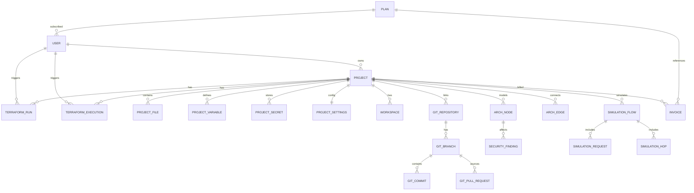

# FRONTEND_DATA_ANALYSIS

## Scope and Method
This document is based on code inspection of:
- `frontend/src/types/`
- `frontend/src/services/`
- `frontend/src/stores/`
- `frontend/src/pages/`
- `frontend/src/components/`
- `frontend/src/hooks/`

Goal: define the backend contract required for full frontend compatibility.

## API Base and Auth Transport
- API base URL: `import.meta.env.VITE_API_URL` with fallback `http://localhost:8000/api/v1`
- Auth header: `Authorization: Bearer <token>`
- Token storage keys used by frontend store:
  - `cf_access_token`
  - `cf_refresh_token`
  - `cf_user`
- Error shape expected by frontend helpers:
  - `message?: string`
  - `error?: string`
  - `detail?: string`
  - `errors?: Record<string, string[]>`

---

## 1) Complete Entity Inventory (from frontend)

## 1.1 Core Auth and User
### `User` (canonical app auth user)
Sources: `src/types/auth.types.ts`, `src/stores/useAuthStore.ts`, `src/pages/Login.tsx`, `src/pages/Register.tsx`

Required fields seen across UI/store:
- `id: string`
- `email: string`
- `name: string`

Also used/expected in some places:
- `username: string` (store shape)
- `avatar: string | null` (store shape)
- `avatar_url: string | null` (typed auth model)
- `plan: "free" | "pro" | "team" | "enterprise"` (store currently uses `free|pro|enterprise`, auth.types includes `team`)
- `created_at: string`
- `updated_at: string`

Auth request/response payload entities:
- `LoginCredentials`: `{ email: string; password: string }`
- `RegisterCredentials`: `{ email: string; password: string; name: string }`
- Register page sends `{ email, password, full_name, plan }`
- `LoginResponse`/`RegisterResponse` currently consumed as:
  - `token?: string`
  - `accessToken?: string`
  - `refreshToken?: string`
  - `idToken?: string` (login only, optional)
  - `user?: User`

Other auth payloads:
- `ResetPasswordRequest`: `{ email: string }`
- `ConfirmResetPassword`: `{ email: string; code: string; newPassword: string }`
- `CognitoTokens`: `{ accessToken: string; idToken: string; refreshToken: string }`

## 1.2 Projects and Project Runs
Source: `src/types/project.types.ts`

### `Project`
- `id: string`
- `name: string`
- `description: string`
- `region: string`
- `environment?: string`
- `status: "draft" | "active" | "deploying" | "deployed" | "failed"`
- `node_count: number`
- `estimated_cost: number`
- `created_at: string`
- `updated_at: string`
- `last_deployed_at: string | null`
- `runs?: TerraformRun[]`

### `TerraformRun`
- `id: string`
- `projectId: string`
- `command: "plan" | "apply" | "destroy" | "init"`
- `status: "success" | "failed" | "running" | "cancelled"`
- `triggeredBy: string`
- `triggeredAt: string`
- `completedAt?: string`
- `planSummary?: { add: number; change: number; destroy: number }`
- `errorMessage?: string`
- `logUrl?: string`
- `logs?: string`

Project-related request shapes:
- `CreateProjectRequest`: `{ name; description; region; template_id? }`
- `UpdateProjectRequest`: `{ name?; description?; region? }`

Project stats:
- `ProjectStats`: `{ total_projects; total_resources; total_estimated_cost }`

## 1.3 Files / Code Editor
Source: `src/types/files.ts`

### `ProjectFile`
- `path: string`
- `name: string`
- `type: "file" | "folder"`
- `content?: string`
- `language?: string`
- `children?: ProjectFile[]`
- `size?: number`
- `createdAt?: string`
- `updatedAt?: string`

Other file payload entities:
- `FileListResponse`: `{ files: ProjectFile[]; total: number }`
- `FileContentResponse`: `{ path; content; language; size }`
- `FileSaveRequest`: `{ path; content; message? }`
- `FileSaveResponse`: `{ path; saved; message }`

## 1.4 Terraform Variables, Secrets, Executions, Workspace Settings
Sources: `src/types/terraform.ts`, `src/types/workspace.ts`

### `ProjectVariable`
- `id: string`
- `key: string`
- `value: string`
- `description?: string`
- `type: "string" | "number" | "bool" | "list" | "map"`
- `isTerraformVar: boolean`
- `isSecret: boolean`
- `defaultValue?: string`

### `ProjectSecret`
- `id: string`
- `key: string`
- `description?: string`
- `secretType: "generic" | "aws_credentials" | "database" | "api_key" | "ssh_key"`
- `createdAt: string`
- `updatedAt: string`
- Value is intentionally not returned by API.

### `TerraformExecution`
- `id: string`
- `projectId: string`
- `command: "init" | "plan" | "apply" | "destroy"`
- `status: "pending" | "running" | "success" | "failed" | "cancelled"`
- `triggeredBy: string`
- `terraformVersion: string`
- `planSummary?: { toAdd: number; toChange: number; toDestroy: number }`
- `outputLogs: string`
- `errorLogs?: string`
- `startedAt: string`
- `finishedAt?: string`
- `durationSeconds?: number`

### Workspace/settings entities
- `TerraformVariable`: `{ name; type; default?; description?; sensitive?; validation? }`
- `TerraformOutput`: `{ name; value; description?; sensitive? }`
- `TerraformBackend`: `{ type: "local"|"s3"|"remote"|"gcs"|"azurerm"; config: Record<string,string> }`
- `TerraformProvider`: `{ name; version?; region?; profile?; alias? }`
- `Workspace`: `{ id; name; description?; isDefault?; variables: Record<string,string>; createdAt; updatedAt }`
- `ProjectSettings`:
  - `terraformVersion: string`
  - `providers: TerraformProvider[]`
  - `backend: TerraformBackend`
  - `variables: TerraformVariable[]`
  - `outputs: TerraformOutput[]`
  - `workspaces: Workspace[]`
  - `activeWorkspaceId: string`

## 1.5 Git / Branching Domain
Source: `src/types/git.ts`

- `GitRepository`
- `GitCommit`
- `GitBranch`
- `TimelineNode`
- `GitFilters` (`dateFrom`, `dateTo`)
- `BranchSync`
- `GitChange`
- `GitPR`
- `GitActivityLog`
- `GitConfig`

Store-only git connection entity (still useful for backend alignment):
- `GitConnection`
- `SyncEntry`

## 1.6 Billing / Plans / Marketplace
Sources: `src/types/billing.ts`, `src/types/marketplace.ts`

- `PlanLimits`
- `Plan`
- `BillingUsage`
- `Invoice`
- `Template`
- `TemplateCategory`

## 1.7 Cloud Architecture / Canvas Domain
Sources: `src/types/aws.ts`, `src/types/aws-resources.ts`, `src/types/cloud.ts`, `src/types/connections.ts`, `src/stores/useEditorStore.ts`

Main entities:
- `AwsNodeData` (includes `type`, `label`, `category`, `properties`, optional resource-specific configs)
- React Flow `Node<AwsNodeData>` and `Edge`
- Resource config entities:
  - `SecurityGroupConfig`, `VpcConfig`, `SubnetConfig`, `EC2Config`, `S3Config`, `RDSConfig`, `LambdaConfig`, `AsgConfig`, `ElbConfig`
- Connection validation entities:
  - `ConnectionValidation`
  - `ConnectionSuggestion`

Important: `AwsComponentType` is a large union including AWS + external services. Backend model should treat this as constrained enum/string domain.

## 1.8 Security Scan Domain
Source: `src/types/security.ts`

- `SecurityFinding`
- `SecurityRule`
- `SecurityContext`
- `SecurityScanResult`

## 1.9 Simulation Domain
Source: `src/types/simulation.ts`

- `SimulationRequest`
- `SimulationHop`
- `SimulationFlow`
- `SimulationScenario`
- `SimulationStats`

## 1.10 Terminal/Logs Domain
Source: `src/types/terminal.types.ts`

- `LogLine`
- `TerminalSource` variants (`websocket`, `sse`, `polling`)
- `UseRunTerminalOptions`
- `UseRunTerminalReturn`

## 1.11 Generic API Wrappers
Source: `src/types/api.types.ts`

- `ApiResponse<T>`
- `ApiError`
- `PaginatedResponse<T>`
- `ApiRequestConfig`
- `PaginationParams`

---

## 2) Complete API Endpoints Expected by Frontend

Notes:
- Base prefix expected: `/api/v1`
- Endpoints below are relative to that base.

## 2.1 Auth endpoints
1. `POST /auth/register`
- Used in: `pages/Register.tsx`
- Request payload sent:
  - `email: string`
  - `password: string`
  - `full_name: string`
  - `plan: string` (selected plan)
- Response consumed:
  - `token?: string`
  - `accessToken?: string`
  - `refreshToken?: string`
  - `user?: { id; email; name; plan; ... }`

2. `POST /auth/login`
- Used in: `pages/Login.tsx`
- Request payload:
  - `email: string`
  - `password: string`
- Response consumed:
  - `token?: string`
  - `accessToken?: string`
  - `refreshToken?: string`
  - `idToken?: string`
  - `user?: User`

3. `GET /auth/me`
- Used in: `stores/useAuthStore.ts` during hydration
- Expected response: `{ user: User }`

4. `POST /auth/refresh`
- Used in: `services/api.ts` interceptor
- Request payload: `{ refreshToken: string }`
- Expected response: `{ accessToken: string; refreshToken: string }`

5. Planned/not wired yet (TODO in page):
- `POST /auth/forgot-password`

## 2.2 Project file endpoints
1. `GET /projects/{projectId}/files`
- Expected shape usually matching `FileListResponse`

2. `GET /projects/{projectId}/files/content?path=<filePath>`
- Expected shape usually matching `FileContentResponse`

3. `POST /projects/{projectId}/files/save`
- Request: `{ path: string; content: string; message?: string }`
- Expected: `FileSaveResponse`-like payload

4. `GET /projects/{projectId}/files/download?path=<filePath>`
- Response type: file/blob

## 2.3 Terraform run endpoints
1. `GET /projects/{projectId}/runs`
- Expected response: `TerraformRun[]`

2. `GET /projects/{projectId}/runs/{runId}`
- Expected response: `TerraformRun`

3. `GET /projects/{projectId}/runs/{runId}/logs`
- Expected response: plain text or string payload

4. `POST /projects/{projectId}/runs/plan`
- Optional body: `Record<string, unknown>`

5. `POST /projects/{projectId}/runs/apply`
- Optional body: `Record<string, unknown>`

6. `POST /projects/{projectId}/runs/destroy`
- Optional body: `Record<string, unknown>`

7. `POST /projects/{projectId}/runs/{runId}/retry`

8. `POST /projects/{projectId}/runs/{runId}/cancel`

## 2.4 Implied project endpoints (frontend feature intent)
Project UI/store performs CRUD flows (currently mostly mock/local state), implying eventual endpoints for:
- project list/detail/create/update/delete/archive
- project settings, variables, secrets, state, git metadata

No active service implementation currently in frontend for these (except runs/files).

---

## 3) Entity Relationships (Mermaid)

---

## 4) Enums and Constants Used by Frontend

## 4.1 Key enum/union domains
- `SortOrder`: `asc | desc`
- `UserPlan`: `free | pro | team | enterprise`
- `PlanId`: `free | pro | team | enterprise`
- `CloudProvider`: `aws | gcp | azure`
- `ProjectStatus`: `draft | active | deploying | deployed | failed`
- `TerraformRunStatus`: `success | failed | running | cancelled`
- `TerraformCommand`: `plan | apply | destroy | init`
- `ProjectTabId`: `overview | runs | code | variables | state | security | git | settings`
- `SecuritySeverity`: `critical | high | medium | low | info`
- `SecurityCategory`: `network | encryption | access | storage | compute | database | monitoring | compliance`
- `HttpMethod`: `GET | POST | PUT | DELETE | PATCH`
- `StatusCode`: `200 | 201 | 301 | 400 | 401 | 403 | 404 | 500 | 502 | 503`
- `LogLevel`: `info | warn | error | success | debug`
- `TerraformBackend.type`: `local | s3 | remote | gcs | azurerm`
- `Workspace variable type`: `string | number | bool | list | map`
- `ProjectSecret.secretType`: `generic | aws_credentials | database | api_key | ssh_key`
- `TerraformExecution.status`: `pending | running | success | failed | cancelled`
- `AwsCategory` and `AwsComponentType`: large unions in `src/types/aws.ts` (must be treated as constrained catalog domains).

## 4.2 Important constants used as domain catalogs/defaults
- `AWS_CATEGORIES`
- `AWS_COMPONENTS`
- `CLOUD_PROVIDERS`
- `DEFAULT_BACKEND`
- `DEFAULT_AWS_PROVIDER`
- `DEFAULT_WORKSPACE`
- `DEFAULT_PROJECT_SETTINGS`
- Connection rules/constants in `src/types/connections.ts`:
  - `ALLOWED_CONNECTIONS`
  - `CONNECTION_ERRORS`

---

## 5) Pagination, Filtering, Sorting Patterns

## 5.1 API-level patterns
- Generic wrappers support request params via `ApiRequestConfig.params`.
- Declared pagination schema:
  - `page`, `per_page`, `total`, `total_pages`
- Declared sorting schema:
  - `sort_by`, `sort_order`

## 5.2 Actual usage observed
- No active server-side pagination calls currently issued by pages/hooks.
- Current backend-facing query params observed:
  - file endpoints use `path` query param.
- Client-side filtering/sorting patterns in UI:
  - Dashboard: search + region/environment filters.
  - Project run history: search + sort.
  - Git timeline: `dateFrom`, `dateTo` filters.
  - Generic `Table` component has client-side sort/pagination.

---

## 6) CRUD Operations Requested by UI Features

## 6.1 Implemented network CRUD (currently called)
- Auth: register/login/read current user/refresh token.
- Files: list/read/save/download.
- Terraform runs: list/read logs/trigger plan/apply/destroy/cancel/retry.

## 6.2 UI CRUD intent currently local/mock (needs backend routes in later phases)
- Projects: create/read/update/delete/archive, set current.
- Variables/secrets CRUD.
- Terraform execution history CRUD-like updates.
- Git connection/activity operations.
- Project settings/workspaces CRUD.

---

## 7) Backend Modeling Implications (Phase 2 input)
1. Backend should normalize around `User`, `Project`, `TerraformRun`, `ProjectFile`, `ProjectVariable`, `ProjectSecret`, `ProjectSettings`, `Workspace`, `Git*` entities.
2. Maintain compatibility for auth response aliases (`token` and `accessToken`) to avoid frontend breakage.
3. Adopt timestamp fields consistently (`created_at`, `updated_at`) and keep naming compatibility where frontend expects camelCase variants via schema serialization when needed.
4. Keep enum domains aligned with frontend unions.
5. Add optional pagination/filter/sort support in repositories/routes even if frontend currently uses mostly client-side filtering.
